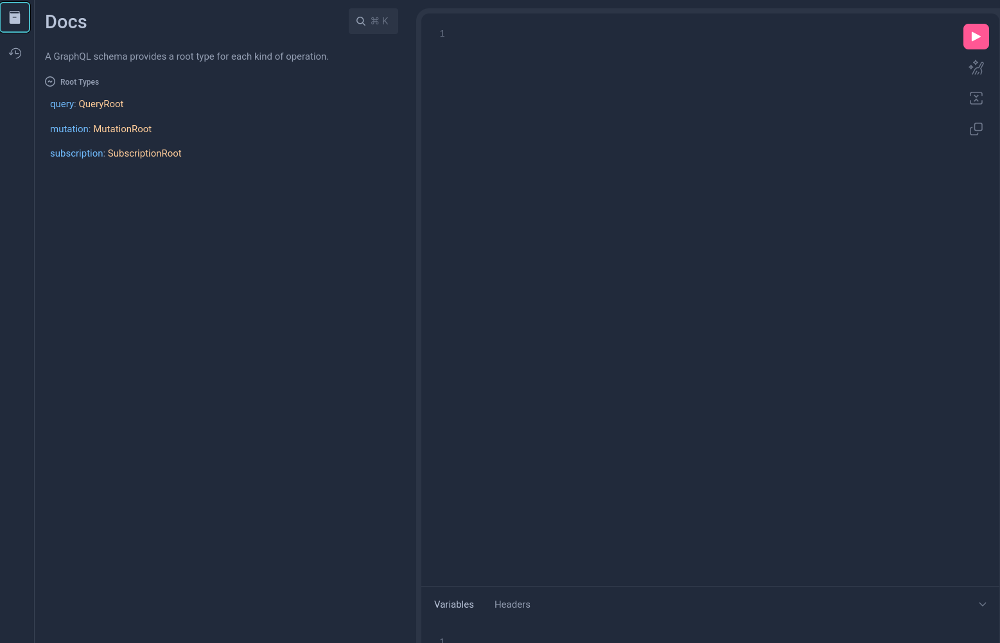

## 节点服务

到目前为止，我们已经了解了如何在终端中使用 Linera 客户端作为二进制文件。然而，客户端还可以作为一个节点运行，具有以下功能：

1. 执行区块
2. 提供 GraphQL API 和 IDE，用于动态与应用程序和系统进行交互
3. 监听来自验证者的通知并自动更新本地链

要与节点服务进行交互，请以服务模式运行 `linera`：

```bash
linera service
```

默认情况下，这将在端口 8080 上运行节点服务（可以使用 `--port` 标志覆盖此设置）。

## GraphQL 注意事项

Linera 使用 GraphQL 作为与系统不同部分进行交互的查询语言。GraphQL 使客户端能够精确地查询他们想要的数据，而不多余获取其他信息。

在应用程序开发过程中，特别是从前端查询应用程序状态时，GraphQL 被广泛使用。

要了解更多关于 GraphQL 的信息，请查阅 [官方文档](https://graphql.org/learn/)。

## GraphiQL IDE

方便地，节点服务提供了一个名为 GraphiQL 的 GraphQL IDE。要使用 GraphiQL，请启动节点服务并导航到 `localhost:8080/`。

通过 GraphiQL IDE 左侧的模式浏览器，您可以动态探索系统和您的应用程序的状态。



## GraphQL 系统 API

节点服务还提供了一个 GraphQL API，对应系统操作的一组。您可以点击 `MutationRoot` 来探索完整的操作集合。

## GraphQL 应用程序 API

要与应用程序进行交互，我们以服务模式运行 Linera 客户端。它在任何拥有的链上运行的每个应用程序的 GraphQL API 位于 `localhost:8080/chains/<chain-id>/applications/<application-id>`。

在浏览器中导航到该位置将打开一个 GraphiQL 接口，使您能够图形化地探索您的应用程序的状态。